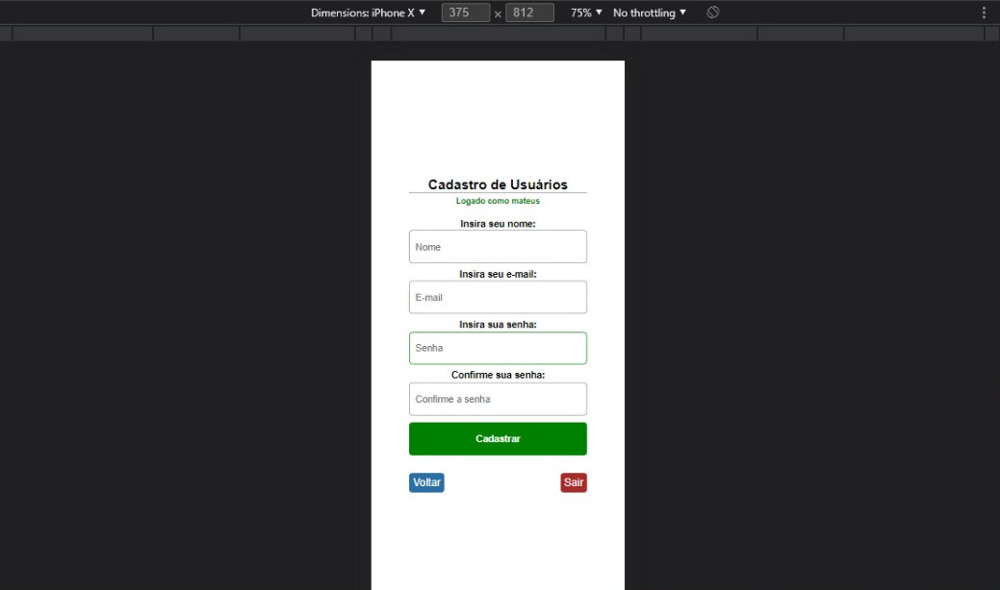

### Remote Excel

App for data control using PHP integrated with EXCEL made for a condominium be able to publish your water data in an Excel table remotely, called Excel Remoto. The project uses a library called PHPSpreadSheet (https://phpspreadsheet.readthedocs.io/en/latest/) for integration with Excel, It's also owns user login system, e etc.

#### Below it's some images:

#### Remote Excel Login Display

#### Remote Excel User Registration Display

#### Remote Excel Water Control Display

#### Remote Excel Choosing which Excel cell to put the data in

Project started on 07/20/2021 by Mateus Emanuel Silva Macedo, owner of this GitHub account, under the guidance of his professor at IFRN Campus Mossoró; Clayton Maciel Costa, using the following technologies: PHP, HTML and CSS.

GitHub profiles of the developers of this project:
Mateus Emanuel Silva Macedo: @mateusesm
Clayton Maciel Costa: @claytonmaciel
